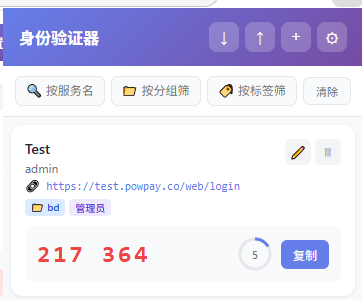
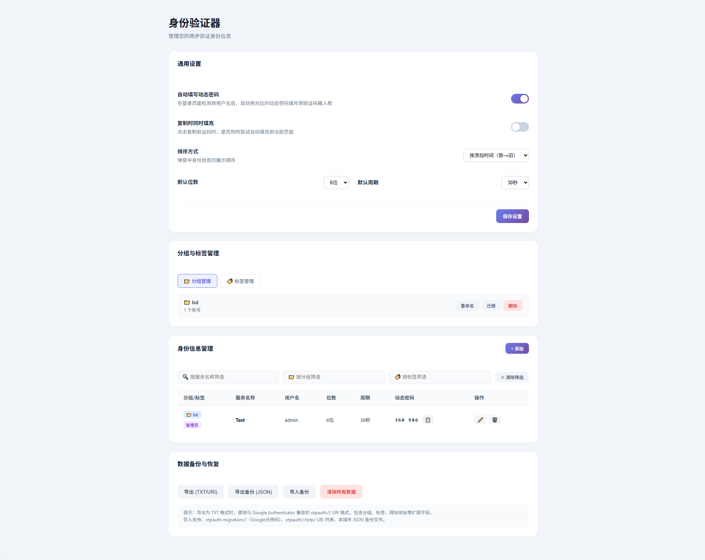
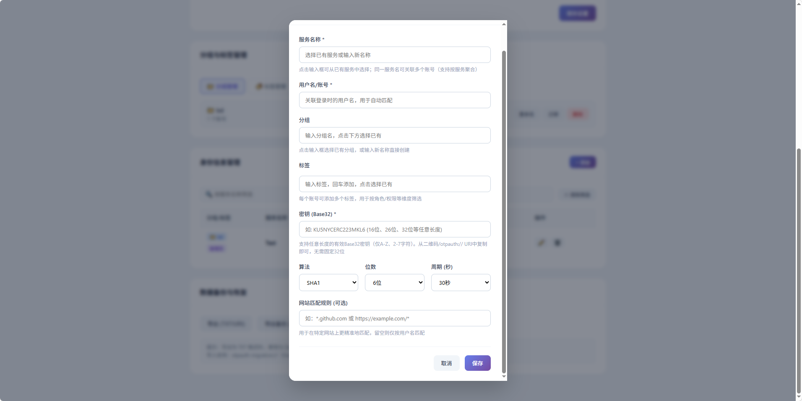

# 身份验证器 - Authenticator (Chrome 扩展)

浏览器端 TOTP 两步验证身份验证器，支持分组管理、标签筛选、QR 码扫码导入、按用户名关联自动填写动态密码，并与 Google Authenticator 兼容的 otpauth URI 导入导出。

## 🆚 与 Google Authenticator 功能对比

| 功能点 | 本插件 | Google Authenticator (移动端) |
|---|:---:|:---:|
| TOTP 动态密码生成（RFC 6238） | ✅ | ✅ |
| SHA-1 / SHA-256 / SHA-512 算法 | ✅ | ✅ |
| 6 位 / 8 位密码，30 / 60 秒周期 | ✅ | ✅ |
| **浏览器内直接使用（无需手机）** | ✅ | ❌ |
| **桌面端一键复制动态密码** | ✅ | ❌（需手机扫码或手动输入） |
| **登录页自动填充 TOTP 到验证码框** | ✅ | ❌ |
| **按用户名 + URL 双维度精准匹配填充** | ✅ | ❌ |
| **子域名严格隔离（防跨站点误填）** | ✅ | ❌ |
| **分组管理（📁 Folder / Group）** | ✅ | ❌（仅按顺序平铺） |
| **多标签分类（🏷️ 一个账号多标签）** | ✅ | ❌ |
| **服务名称聚合（下拉复用，去重维护）** | ✅ | ❌（每次手动输入） |
| **多维度筛选（服务 / 分组 / 标签）** | ✅ | ❌（仅搜索账号名） |
| **一键清除所有筛选** | ✅ | ❌ |
| **批量导入（迁移码 / URI / JSON）** | ✅ | ⚠️（仅支持扫码逐条 + 迁移码） |
| **智能去重导入（service+account 唯一键）** | ✅ | ❌（重复账号无法自动区分） |
| **导入时自动补全空 loginUrl** | ✅ | ❌ |
| **导入统计（新增 / 更新 / 跳过 / 错误）** | ✅ | ❌ |
| **导出 otpauth URI（Google 兼容）** | ✅ | ❌（仅导出迁移码，不便阅读） |
| **导出 JSON 完整备份** | ✅ | ❌ |
| **浏览器本地存储（随浏览器同步）** | ✅ | ❌（Google 账号云端同步） |
| **二维码扫码录入（jsQR 本地解析）** | ✅ | ✅ |
| **桌面端编辑 / 删除 / 批量管理页面** | ✅ | ❌（仅移动端单条操作） |





---

## ✨ 功能特性

### 1. 标准 TOTP 动态密码生成
- 标准 RFC 6238 TOTP 算法实现
- 支持 6 位 / 8 位密码
- 支持 30 秒 / 60 秒刷新周期
- 支持 SHA-1 / SHA-256 / SHA-512 算法
- 倒计时进度显示，到期自动刷新
- 一键复制到剪贴板

### 2. 分组与标签管理
- **分组**：每个账号归属一个分组，按分组聚合显示
- **标签**：每个账号可添加多个标签，按任意维度分类
- **服务名称聚合**：同一服务名下可管理多个账号，下拉选择已有服务避免重复输入
- **下拉 + 自由输入模式**：服务名称、分组、标签均支持「从已有选项选择」或「输入新值回车创建」

### 3. 多维度筛选
- 按 **服务名称** 筛选
- 按 **分组** 筛选
- 按 **标签** 筛选
- 三条件可组合使用，一键「清除」取消所有筛选

### 4. 用户名 + 登录地址双重关联（自动匹配）
- 添加身份信息时必须填写 **用户名/账号**
- **「登录页面地址/域名」字段**：同一用户名在不同网站（如 GitHub 与 GitLab 均使用 `user@example.com` 但各自独立 TOTP）通过 URL 精确区分
- 匹配优先级：`URL 精确命中 > 同根域名匹配 > 未填 URL 的通用身份`
- 支持站点匹配规则：完整 URL、域名、`*.example.com` 通配符、`https://xxx.com/login/*` 路径通配
- **子域名严格隔离**：仅当 URL 与用户名同时匹配时才自动填充，防止跨网站凭据泄露

### 5. 登录页自动填写（用户名 + URL 双维度）
- 自动检测页面上的用户名输入框
- 取输入的用户名 **+ 当前页面 URL** 同时匹配
- 若存在多条同用户名记录：只选择 URL 匹配的那一条，避免跨网站误填
- 根据匹配到的身份信息生成 TOTP 码并自动填写到验证码/动态密码输入框
- 填写后显示绿色「🔐 已自动填充」提示
- 若未找到输入框会在后续 8 秒内重试查找

### 6. 多种导入方式（含去重）
- **Google Authenticator 迁移码**：支持 `otpauth-migration://offline?data=...` 格式
- **otpauth URI 列表 (.txt)**：标准 `otpauth://totp/...` 一行一条
- **JSON 备份**：本扩展导出的 JSON 格式
- **智能去重规则**：以「服务名称(issuer) + 用户名(account)」（不区分大小写）为唯一键
  - 新账号 → 直接导入（Imported）
  - 重复账号 → 跳过（Skipped）
  - 旧记录 `loginUrl` 为空而新记录有值 → 仅更新 URL（Updated）
- 导入后反馈统计：**总计 / 新增 / 更新 / 跳过 / 错误**，并以绿/黄/橙/红 四色状态提示

### 7. 二维码扫码录入
- 支持直接扫描 Google Authenticator、Authy 等导出的二维码
- 自动解析 otpauth URI 并填入添加表单
- 基于 `jsQR` 本地解析，无网络上传

### 8. 多种导出格式
- **TXT / URI 格式（推荐，与 Google Authenticator 兼容）**：
  标准 `otpauth://totp/` URI，附带扩展字段：
  - `group=` 分组
  - `tags=` 标签（逗号分隔）
  - `loginUrl=` 登录地址
- **JSON 备份**：完整字段导出，用于本扩展内部恢复

### 9. 数据管理与安全
- 所有数据存储在 Chrome 本地存储中
- 支持一键导出备份
- 支持一键清空所有数据

---

## 📦 安装方式

### 开发者模式加载
1. 打开 Chrome / Edge 浏览器，访问 `chrome://extensions/`
2. 右上角开启 **开发者模式**
3. 点击 **加载已解压的扩展程序**
4. 选择本项目根目录 `browser_authenticator` 文件夹
5. 安装完成，工具栏出现扩展图标

---

## 📁 目录结构

```
browser_authenticator/
├── manifest.json               # 扩展配置文件 (Manifest V3)
├── LICENSE                     # MIT 开源协议
├── README.md
├── popup/                      # 点击图标弹出的面板
│   ├── popup.html  popup.css  popup.js
├── options/                    # 选项/设置页面（完整管理界面）
│   ├── options.html  options.css  options.js
├── content/
│   └── content.js              # 注入到页面的自动填充脚本
├── background/
│   └── background.js           # Service Worker 后台
├── lib/
│   ├── totp.js                 # TOTP 算法（popup/options 用）
│   ├── storage.js              # 存储与导入/去重封装
│   └── qrscanner.js            # jsQR 封装
├── icons/                      # 扩展图标 16/48/128
├── imgs/                       # README 预览图
│   ├── popup.png  option.png  add.png
└── scripts/
    ├── gen-icons.js            # 图标生成脚本
    └── test-totp.js            # TOTP 算法测试
```

---

## 📖 使用指南

### 添加身份信息

**方式一：弹窗面板**
1. 点击工具栏图标 → 右上角「+」
2. 服务名称：下拉选择已有或输入新名称（同一服务下可关联多个账号）
3. 用户名/账号：必须准确，用于登录页匹配（大小写不敏感）
4. 登录页面地址/域名（强烈推荐）：
   - 填写域名：`github.com`
   - 填写完整 URL：`https://github.com/login`
   - 填写通配子域：`*.google.com`
   - 填写路径通配：`https://console.cloud.google.com/*`
5. 分组：下拉选择或输入新分组
6. 标签：回车可添加多个，下拉选择已有标签
7. 密钥：粘贴服务提供的 Base32 密钥（支持 16/26/32 位任意长度）
8. 算法 / 位数 / 周期：按服务要求调整，默认 SHA-1 / 6 位 / 30 秒

**何时必须填 URL：**
- 同一邮箱/用户名在 GitHub、GitLab、Gitee 等多个站点各有独立 TOTP 密钥时
- 若不填 URL，所有站点同用户名都会匹配到该身份（通用身份）
- 建议每个服务都填写对应域名，精确匹配避免误填

**方式二：扫码添加**
- 直接扫描服务提供的 TOTP 二维码，自动填充表单

**方式三：批量导入**
- 右键扩展图标 → 选项 → 数据备份与恢复 → 导入备份

### 筛选与查找
弹窗面板 / 选项页的身份信息管理区，均提供三列筛选栏：
1. 按服务名称（🔍）
2. 按分组（📁）
3. 按标签（🏷️）
4. 点击右侧「清除」一键取消所有筛选

### 自动填写使用流程
1. 打开任意网站登录页
2. 在用户名/邮箱输入框中填入与已保存身份**完全一致**的用户名
3. 输入框失焦或回车后，插件自动：
   - 根据用户名 + 当前页面 URL 查找关联身份
   - 生成当前 TOTP 动态密码
   - 填入页面的「验证码/动态密码/OTP」输入框
4. 输入框上方出现绿色 🔐 提示，确认已填充

### 手动复制
若自动填写未命中目标输入框：
- 点击工具栏扩展图标
- 点击对应身份的「复制」按钮
- 手动粘贴到输入框

### 备份与恢复
1. 进入**选项**页 → 数据备份与恢复
2. **导出 (TXT/URI)**：导出 Google Authenticator 兼容的 otpauth URI 列表
3. **导出备份 (JSON)**：完整字段导出
4. **导入备份**：支持 otpauth-migration / otpauth URI / JSON 三种格式
5. **清除所有数据**：清空扩展存储的全部账号与设置

---

## ⚙️ 设置项说明

| 选项 | 默认 | 说明 |
|------|------|------|
| 自动填写动态密码 | 开启 | 登录页检测到用户名后自动填充 TOTP 到验证码框 |
| 复制时同时填充 | 关闭 | 点击复制时同步发送到当前页面（预留） |
| 排序方式 | 按添加时间 | 弹窗展示顺序：按添加时间 / 按服务名称 / 按分组+名称 |
| 默认位数 | 6 位 | 新增身份时预填 |
| 默认周期 | 30 秒 | 新增身份时预填 |

---

## 🔧 技术要点

- **Manifest V3**：符合 Chrome 最新扩展规范，Service Worker 架构
- **Web Crypto API**：使用原生 `crypto.subtle` 执行 HMAC，无第三方加密依赖
- **Content Script + Storage**：content script 直接读取 storage，更可靠
- **DOM 监听**：MutationObserver 监听 SPA 动态渲染的输入框
- **选择器策略**：覆盖 `name` / `id` / `autocomplete` / `placeholder` 中英文等多种常见模式
- **自动重试**：OTP 输入框延迟加载时自动重试最多 10 次
- **去重存储层**：`lib/storage.js` 统一的导入/去重/更新逻辑，返回 `{ imported, skipped, updated, errors, total }` 标准化统计对象

---

## ⚠️ 注意事项

1. **密钥安全**：存储在浏览器本地存储中。请定期导出加密备份妥善保管。
2. **用户名 + URL 双重匹配**：
   - 仅用户名完全相同（忽略大小写/空格）时才会命中候选
   - 候选中带 URL 的身份与当前页面 URL 匹配成功则优先使用
   - 候选中完全未填 URL 的身份视为「通用」，当无 URL 命中时回退
   - 若有多条同用户名且都命中 URL：取排序最靠前的一条
3. **URL 匹配规则细节**：
   - 填 `github.com` → 命中 `github.com`、`gist.github.com`、任意子域名
   - 填 `*.github.com` → 只命中子域名，不命中裸 `github.com`
   - 填完整 `https://xxx.com/login` → 仅精确路径或其下级路径命中
4. **权限说明**：
   - `storage`：保存账号与设置
   - `<all_urls>`：在所有网站的登录页启用自动填充
   - `activeTab` / `scripting`：基础扩展能力

---

## 📄 开源协议

本项目采用 [MIT License](LICENSE) 协议开源。
